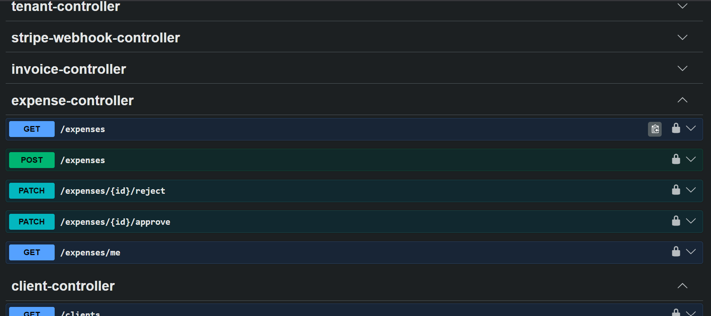
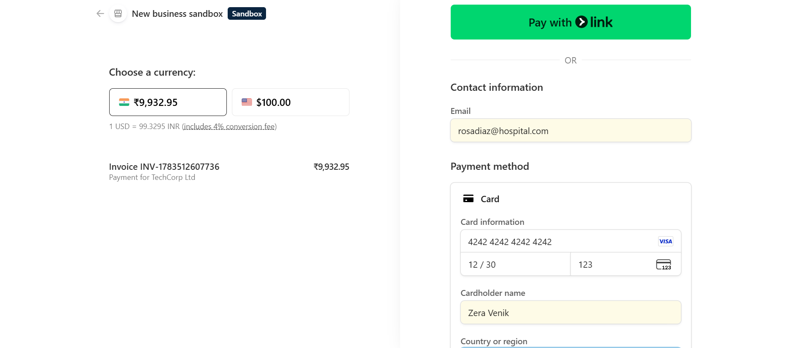
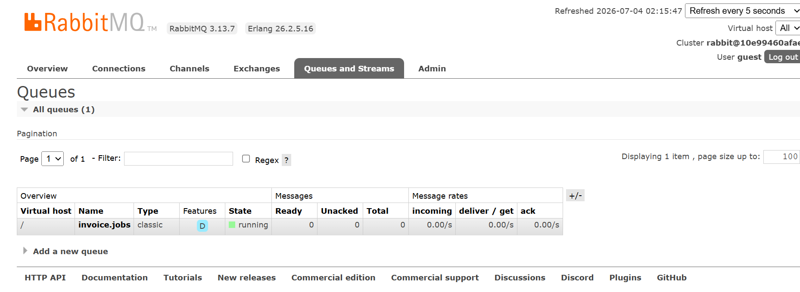
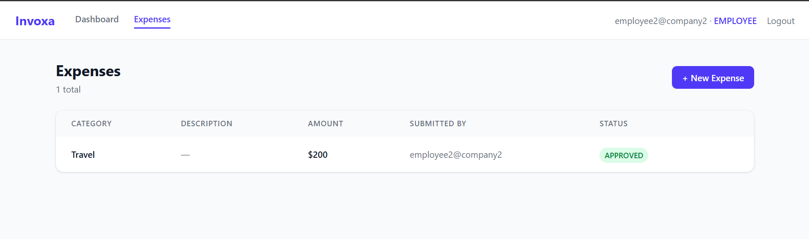
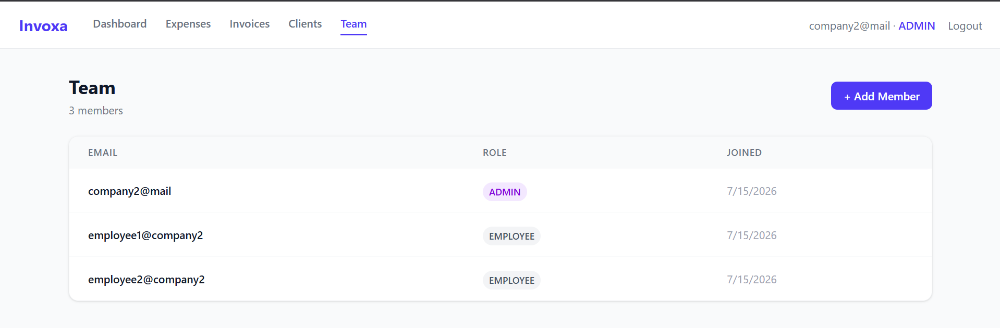

# Invoxa — Multi-Tenant Expense & Invoice Management API

A production-grade backend SaaS API built with **Java 21 + Spring Boot**, demonstrating multi-tenancy, JWT auth, role-based access control, async processing via RabbitMQ, real Stripe payment integration, and outbound webhook delivery.

- **Live Frontend**: https://invoxa-multitenant-expense-invoice.vercel.app
- **Live API**: https://invoxa-multitenant-expense-invoice-api-production.up.railway.app
- **Swagger UI**: https://invoxa-multitenant-expense-invoice-api-production.up.railway.app/swagger-ui/index.html
- **GitHub**: https://github.com/Nehalrai/invoxa-multitenant-expense-invoice-api

---

## What It Does

Invoxa is the backend for a B2B SaaS platform where multiple companies (tenants) manage internal expense approvals and client invoice billing on one shared instance, with complete data isolation between tenants.

- **Expenses (money out)**: employees submit, admins/accountants approve or reject, every state change is audit-logged.
- **Invoices (money in)**: admins create invoices with line items, sending one generates a real Stripe Checkout link, and a webhook auto-marks it PAID when the client pays.
- **Teams**: admins invite members as ADMIN, ACCOUNTANT, or EMPLOYEE, with roles enforced on both frontend (UI) and backend (`@PreAuthorize`).

---

## Architecture

```
HTTP Request
     │
     ▼
JwtAuthFilter (validates token, extracts tenantId + role)
     │
     ▼
Controller → Service → Repository (all queries scoped by tenantId)
     │
     ├── AuditService (logs every state change)
     │
     ├── RabbitMQ Publisher (after DB commit via afterCommit())
     │        │
     │        ▼
     │   RabbitMQ Queue (CloudAMQP)
     │        │
     │        ▼
     │   InvoiceJobConsumer (background thread)
     │        └── PDF Generation (OpenPDF)
     │
     └── StripeService (creates Checkout Sessions)
              │
              ▼
         Stripe Webhook → marks invoice PAID → fires outbound webhook
```

**Multi-tenancy**: shared-schema, row-level isolation — every table has a `tenant_id` column pulled from the JWT (never trusted from the request body), and every query is explicitly scoped to it. Schema-per-tenant is the documented upgrade path for stronger isolation at scale.

---

## Tech Stack

Java 21 · Spring Boot 4.1 · PostgreSQL 18 · Spring Data JPA/Hibernate · Flyway · JWT (jjwt) + Spring Security · RabbitMQ (CloudAMQP) · Stripe Java SDK · OpenPDF · Bucket4j · Springdoc OpenAPI · Docker · Railway (backend) · React/Vite/Tailwind + Vercel (frontend)

---

## Engineering Decisions Worth Noting

**Async invoice processing** — Creating/sending an invoice returns immediately. The RabbitMQ message is published only after the DB transaction commits (`TransactionSynchronizationManager` → `afterCommit()`), avoiding a race where the consumer fetches a record that hasn't committed yet. The consumer uses `JOIN FETCH` to sidestep lazy-loading issues in a detached Hibernate context.

**Stripe webhook idempotency** — Stripe delivers webhooks at-least-once, so duplicates are expected. Every processed `event.id` is stored in a `processed_stripe_events` table and checked before processing; signatures are verified via `Webhook.constructEvent()` first.

**Audit logging** — Immutable, append-only, and self-contained (no FK to `users`), so records survive user deletion. Covers every expense and invoice state change.

**Outbound webhooks** — Tenants register a callback URL; invoice-paid events POST a JSON payload to it. Delivery failures are logged but never block the payment flow itself.

**Rate limiting** — Login is capped at 10 req/min per IP via Bucket4j, returning `429` when exceeded.

---

## Screenshots

| Swagger UI | Stripe Checkout | RabbitMQ |
|---|---|---|
|  |  |  |

| Employee Dashboard | Admin — Team Management |
|---|---|
|  |  |

More in [`/screenshots`](screenshots) — audit log, webhook confirmation, DB schema.

---

## Known Simplifications → Production Upgrade Path

| Current (Portfolio) | Production |
|---|---|
| Row-level multi-tenancy | Schema-per-tenant |
| Admin sets password on invite | Email-based invite + temp password |
| Local PDF storage | S3 with signed URLs |
| In-memory rate limiting | Redis-backed distributed limiting |
| JWT secret in config file | AWS Secrets Manager / Vault |

---

## Running Locally

```bash
git clone https://github.com/Nehalrai/invoxa-multitenant-expense-invoice-api.git
cd invoxa-multitenant-expense-invoice-api
docker-compose up -d
./mvnw spring-boot:run
cd frontend && npm install && npm run dev
```

Needs `src/main/resources/application.yaml` (gitignored — contains secrets) with your Postgres, RabbitMQ, JWT, and Stripe config. See [`SETUP.md`](SETUP.md) for the full template and Stripe CLI webhook setup.

Verify: `localhost:8080/actuator/health`, `localhost:8080/swagger-ui/index.html`, `localhost:5173`.

---

## API Reference

Full endpoint documentation, request/response schemas, and a live try-it-out console are in [Swagger UI](https://invoxa-multitenant-expense-invoice-api-production.up.railway.app/swagger-ui/index.html). Covers auth, team management, expenses, clients, invoices, tenant webhook config, and the Stripe webhook receiver.
