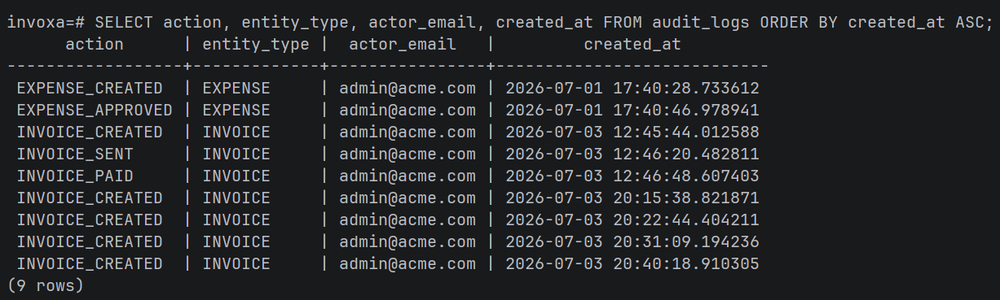
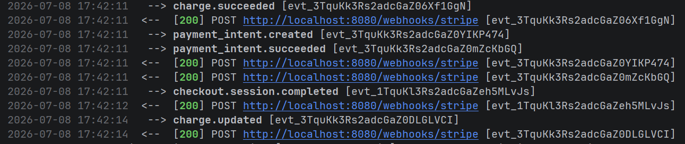
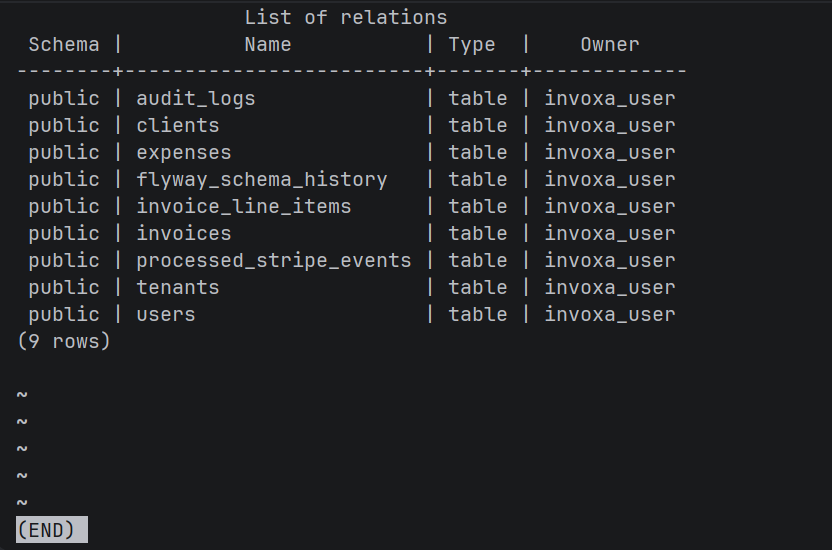

# Invoxa — Multi-Tenant Expense & Invoice Management API

A production-grade, backend-heavy SaaS API built with **Java 21 + Spring Boot**, demonstrating multi-tenancy, JWT authentication, role-based access control, asynchronous processing, real Stripe payment integration, and outbound webhook delivery.

**Live Frontend**: https://invoxa-multitenant-expense-invoice.vercel.app  
**Live API**: https://invoxa-multitenant-expense-invoice-api-production.up.railway.app  
**Swagger UI**: https://invoxa-multitenant-expense-invoice-api-production.up.railway.app/swagger-ui/index.html  
**GitHub**: https://github.com/Nehalrai/invoxa-multitenant-expense-invoice-api

---

## Screenshots

### Swagger UI — Live Interactive API Documentation


### Audit Log — Full Business Lifecycle Captured


### RabbitMQ — Async Message Queue Running


### Stripe Webhook — Payment Confirmed (200 OK)


### Stripe Checkout — Real Payment Page


### Database Schema — 9 Tables via Flyway Migrations


### Team Management — Role-Based Access Control


### Employee View — Limited Access (Dashboard + Expenses only)


---

## What It Does

Invoxa is the backend for a B2B SaaS platform where multiple companies (tenants) can manage their internal expense approvals and client invoice billing — all on the same running instance, with complete data isolation between tenants.

**Expense Management (money out)**
- Employees submit expense requests (amount, category, description)
- Accountants/admins approve or reject them
- Every state change is logged in an immutable audit trail

**Invoice Management (money in)**
- Admins create invoices for clients with line items (auto-calculated totals)
- Sending an invoice generates a real Stripe Checkout payment link
- When a client pays via Stripe, a webhook marks the invoice as PAID automatically
- If a tenant has registered a webhook URL, they receive an `invoice.paid` notification

**Team Management**
- Admins can invite team members with specific roles (ADMIN, ACCOUNTANT, EMPLOYEE)
- Role-based UI: employees only see Dashboard and Expenses; accountants see invoices and clients; admins see everything including team management
- Each role enforced both on the frontend (UI hiding) and backend (`@PreAuthorize` method-level security)

---

## Tech Stack

| Layer | Technology |
|---|---|
| Language | Java 21 |
| Framework | Spring Boot 4.1 |
| Database | PostgreSQL 18 |
| ORM | Spring Data JPA + Hibernate |
| Migrations | Flyway |
| Auth | JWT (jjwt 0.12.6) + Spring Security |
| Message Queue | RabbitMQ (CloudAMQP) |
| Async Jobs | Spring AMQP + `@RabbitListener` |
| PDF Generation | OpenPDF |
| Payments | Stripe Java SDK |
| Rate Limiting | Bucket4j |
| API Docs | Springdoc OpenAPI 3 (Swagger UI) |
| Containerization | Docker + Docker Compose |
| Backend Deployment | Railway |
| Frontend | React + Vite + Tailwind CSS |
| Frontend Deployment | Vercel |

---

## Architecture

```
HTTP Request
     │
     ▼
JwtAuthFilter (validates token, extracts tenantId + role)
     │
     ▼
Controller → Service → Repository (all queries scoped by tenantId)
     │
     ├── AuditService (logs every state change)
     │
     ├── RabbitMQ Publisher (after DB commit via afterCommit())
     │        │
     │        ▼
     │   RabbitMQ Queue (CloudAMQP)
     │        │
     │        ▼
     │   InvoiceJobConsumer (background thread)
     │        └── PDF Generation (OpenPDF)
     │
     └── StripeService (creates Checkout Sessions)
              │
              ▼
         Stripe Webhook → marks invoice PAID → fires outbound webhook
```

### Multi-Tenancy Strategy

Uses **shared-schema row-level isolation**: every table has a `tenant_id` column, and every query is explicitly scoped to the authenticated user's tenant. The `tenant_id` is extracted from the JWT on every request — never trusted from the request body.

Alternative considered: schema-per-tenant (stronger isolation, higher operational complexity). Row-level was chosen for this project's scope; schema-per-tenant is documented as the production-scale upgrade path.

---

## Key Features & Engineering Decisions

### JWT Authentication
- Stateless, no server-side sessions
- JWT payload carries `userId`, `tenantId`, `email`, `role` — enabling tenancy enforcement without DB lookups on every request
- Custom `JwtAuthFilter` extends `OncePerRequestFilter`, populates Spring Security context

### Role-Based Access Control
Three roles per tenant: `ADMIN`, `ACCOUNTANT`, `EMPLOYEE`
- Method-level enforcement via `@PreAuthorize("hasRole('ADMIN') or hasRole('ACCOUNTANT')")`
- Checked before business logic runs, not after
- Frontend UI conditionally renders tabs and action buttons based on role
- Full demo workflow: Admin invites Employee → Employee submits expense → Admin approves it

### Asynchronous Invoice Processing
- Creating/sending an invoice returns immediately to the caller
- A RabbitMQ message is published **after** the database transaction commits (`TransactionSynchronizationManager.registerSynchronization` → `afterCommit()`)
- This prevents the race condition where a consumer tries to fetch a record that hasn't committed yet
- A `@RabbitListener` consumer in a separate thread generates the PDF using `JOIN FETCH` to avoid lazy-loading issues in a detached Hibernate context

### Stripe Webhook Idempotency
- Stripe guarantees **at-least-once** webhook delivery — the same event can arrive multiple times
- Every processed `event.id` is stored in `processed_stripe_events` table
- Before processing, existence is checked — duplicate events are silently skipped
- Webhook signature is verified via `Webhook.constructEvent()` before any processing

### Audit Logging
- Immutable append-only table: `actor_user_id`, `actor_email`, `action`, `entity_type`, `entity_id`, `metadata`, `created_at`
- No foreign keys to `users` table — audit records are self-contained historical facts that survive user deletion
- Covers: expense created/approved/rejected, invoice created/sent/paid

### Outbound Webhooks
- Tenants register a callback URL via `PUT /tenant/webhook`
- On invoice paid (via Stripe or manual), a JSON payload is POSTed to that URL
- Delivery failures are logged but don't affect the main payment flow

### Rate Limiting
- Login endpoint (`POST /auth/login`) rate-limited per IP using Bucket4j
- 10 requests per minute per IP; returns `429 Too Many Requests` when exceeded

---

## API Endpoints

### Auth
| Method | Path | Access | Description |
|---|---|---|---|
| POST | `/auth/signup` | Public | Create tenant + admin user, returns JWT |
| POST | `/auth/login` | Public | Login, returns JWT |
| GET | `/auth/me` | Authenticated | Returns decoded JWT claims |

### Users / Team
| Method | Path | Access | Description |
|---|---|---|---|
| POST | `/users/invite` | Admin only | Add a team member with a role |
| GET | `/users` | Admin only | List all team members in tenant |

### Expenses
| Method | Path | Access | Description |
|---|---|---|---|
| POST | `/expenses` | Any role | Submit an expense |
| GET | `/expenses/me` | Any role | List my own expenses |
| GET | `/expenses` | Admin/Accountant | List all tenant expenses |
| PATCH | `/expenses/{id}/approve` | Admin/Accountant | Approve an expense |
| PATCH | `/expenses/{id}/reject` | Admin/Accountant | Reject an expense |

### Clients
| Method | Path | Access | Description |
|---|---|---|---|
| POST | `/clients` | Admin/Accountant | Create a client |
| GET | `/clients` | Admin/Accountant | List all clients |
| GET | `/clients/{id}` | Admin/Accountant | Get a specific client |

### Invoices
| Method | Path | Access | Description |
|---|---|---|---|
| POST | `/invoices` | Admin/Accountant | Create invoice with line items |
| GET | `/invoices` | Admin/Accountant | List all invoices |
| GET | `/invoices/{id}` | Admin/Accountant | Get invoice details |
| PATCH | `/invoices/{id}/send` | Admin/Accountant | Send invoice (generates Stripe payment link) |
| PATCH | `/invoices/{id}/pay` | Admin/Accountant | Manually mark as paid |

### Tenant
| Method | Path | Access | Description |
|---|---|---|---|
| PUT | `/tenant/webhook` | Admin | Register outbound webhook URL |

### Webhooks
| Method | Path | Access | Description |
|---|---|---|---|
| POST | `/webhooks/stripe` | Public (Stripe) | Stripe webhook receiver |

---

## Database Schema

```
tenants
  └─── users (many per tenant)
  └─── expenses (many per tenant, submitted by a user)
  └─── clients (many per tenant)
  └─── invoices (many per tenant, belongs to a client)
           └─── invoice_line_items (many per invoice)

audit_logs (tenant-scoped, append-only)
processed_stripe_events (idempotency table)
flyway_schema_history (Flyway internal tracking)
```

Schema managed entirely by **Flyway** versioned migrations (V1–V5). Hibernate is set to `validate` mode locally.

---

## Demo Workflow

Here's the full intended workflow to demo the project:

**1. Sign up** — creates a new company (tenant) + admin user  
**2. Add team members** — Team tab → add an employee and an accountant  
**3. Log in as employee** — notice limited UI (only Dashboard + Expenses)  
**4. Submit expense** — employee submits a travel/software expense  
**5. Log back in as admin** — see the employee's expense, approve it  
**6. Add a client** — Clients tab → add a company you're billing  
**7. Create an invoice** — Invoices tab → add line items, total auto-calculates  
**8. Send invoice** — generates real Stripe Checkout link  
**9. Pay via Stripe** — use test card `4242 4242 4242 4242`  
**10. Invoice auto-marked PAID** — via Stripe webhook  
**11. Check Dashboard** — stats update: approved expenses, paid revenue  

---

## Running Locally

### Prerequisites
- Java 21
- Docker Desktop
- Stripe CLI (for webhook testing)
- Node.js 18+

### Setup

**1. Clone the repo**
```bash
git clone https://github.com/Nehalrai/invoxa-multitenant-expense-invoice-api.git
cd invoxa-multitenant-expense-invoice-api
```

**2. Create `src/main/resources/application.yaml`**

This file is in `.gitignore` (contains secrets). Create it locally:

```yaml
spring:
  application:
    name: Invoxa
  datasource:
    url: jdbc:postgresql://localhost:5432/invoxa
    username: invoxa_user
    password: invoxa_pass
    driver-class-name: org.postgresql.Driver
  jpa:
    hibernate:
      ddl-auto: validate
    show-sql: true
  flyway:
    enabled: true
    locations: classpath:db/migration
  rabbitmq:
    host: localhost
    port: 5672
    username: guest
    password: guest

jwt:
  secret: "ThisIsADevOnlySecretKeyChangeMe1234567890ABCDEF"
  expiration-ms: 86400000

server:
  port: 8080

stripe:
  secret-key: sk_test_YOUR_STRIPE_KEY
  webhook-secret: whsec_YOUR_WEBHOOK_SECRET

invoxa:
  rabbitmq:
    queues:
      invoice-jobs: invoice.jobs

springdoc:
  api-docs:
    path: /v3/api-docs
  swagger-ui:
    path: /swagger-ui.html
```

**3. Start dependencies**
```bash
docker-compose up -d
```

**4. Run the backend**
```bash
./mvnw spring-boot:run -Dspring-boot.run.jvmArguments="-Duser.timezone=UTC"
```

**5. Run the frontend**
```bash
cd frontend
npm install
npm run dev
```

**6. Verify**
```
http://localhost:8080/actuator/health       →  {"status":"UP"}
http://localhost:8080/swagger-ui/index.html →  Full API docs
http://localhost:5173                        →  Frontend
```

**7. Test Stripe webhooks locally**
```bash
stripe listen --forward-to localhost:8080/webhooks/stripe
```

---

## Known Simplifications & Production Upgrade Path

| Current (Dev/Portfolio) | Production Upgrade |
|---|---|
| Row-level multi-tenancy | Schema-per-tenant for stronger isolation |
| Global unique email | Email unique per tenant |
| Admin sets password when inviting users | Email-based invitation with temporary password |
| Local PDF storage | S3/object storage with signed URLs |
| Stripe test mode | Stripe live mode with key rotation |
| Single RabbitMQ consumer | Horizontally scaled consumer pool |
| In-memory rate limiting (Bucket4j) | Redis-backed distributed rate limiting |
| JWT secret in config file | AWS Secrets Manager / HashiCorp Vault |

---

## Project Structure

```
src/main/java/com/expenseapi/Invoxa/
├── config/          # SecurityConfig, RabbitMQConfig, OpenApiConfig, CorsConfig
├── controller/      # AuthController, ExpenseController, InvoiceController,
│                    # ClientController, TenantController, UserController,
│                    # StripeWebhookController
├── dto/             # Request/Response DTOs with Bean Validation
├── messaging/       # InvoiceJobPublisher, InvoiceJobConsumer, InvoiceMessage
├── model/           # JPA entities (Tenant, User, Expense, Invoice, etc.)
├── repository/      # Spring Data JPA repositories
├── security/        # JwtService, JwtAuthFilter, AuthenticatedUser, RateLimitFilter
└── service/         # AuthService, ExpenseService, InvoiceService, UserService
                     # AuditService, StripeService, OutboundWebhookService,
                     # PdfGenerationService, ClientService

frontend/            # React + Vite + Tailwind CSS
├── src/
│   ├── pages/       # Dashboard, Expenses, Invoices, Clients, Team, AuthPage
│   ├── components/  # Layout (role-based navigation)
│   ├── AuthContext.jsx
│   └── api.js
```

---

## Author

**Nehal Rai** — BTech Information Technology
Built as a portfolio project demonstrating production-grade backend engineering patterns.

[](https://github.com/Nehalrai)
